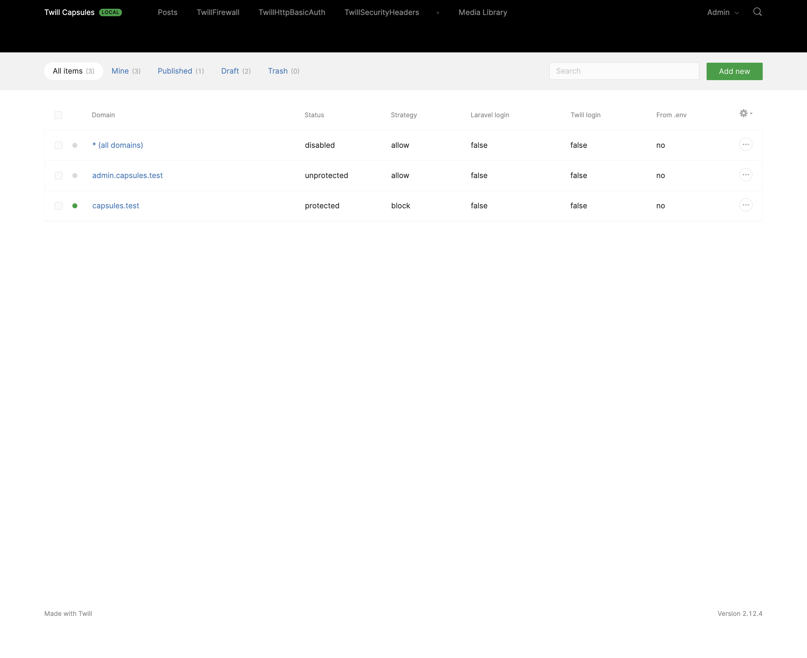
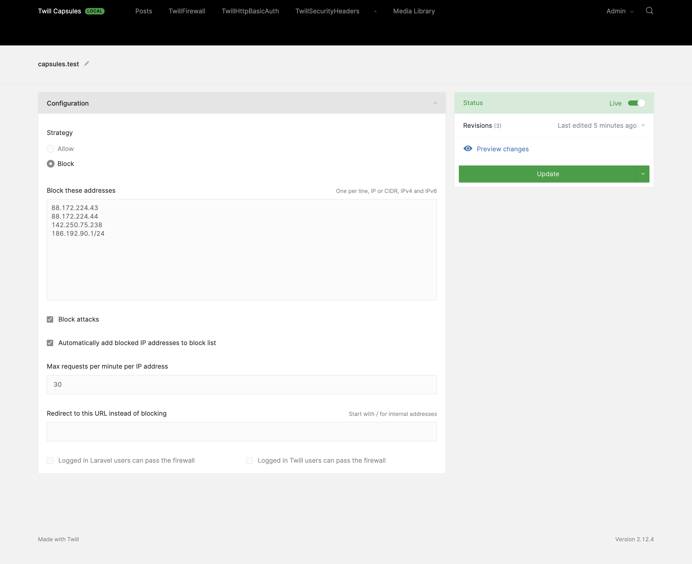

# Firewall Twill Capsule

This Twill Capsule is intended to enable developers to configure an application internal firewall. 





## Domains

You add as many domains as you need and configure different strategies for each. Once you enable the `all domains (*)` entry, the same configuration will be used for all, and all other domains will be hidden.

## Features

- "Allow" strategy: only allow access to the listed IP addresses 
- "Block" strategy: block all listed IP addresses
- Detects and blocks automatically attacks
- Automatically add block attacker IP addresses to the block list
- Redirection instead of blocking. Allow displaying a "Coming soon" page to external users, while giving access to the team. 

## Middleware

A middleware is automatically added to all `web` routes, but you can configure this behaviour or even disable it to configure your middleware yourself:  

``` php
'middleware' => [
    'automatic' => true,

    'groups' => ['web'],

    'class' => \A17\TwillFirewall\Http\Middleware::class,
],
```

## Using authentication

If you have authorization on your app (as you have on Twill), you can exempt logged in users from the rate limit, so they don't risk getting blocked.

## Installing

### Require the Composer package:

``` bash
composer require area17/twill-firewall
```

### Publish the configuration

``` bash
php artisan vendor:publish --provider="A17\TwillFirewall\ServiceProvider"
```

### Load Capsule helpers by adding calling the loader to your AppServiceProvider:

``` php
/**
 * Register any application services.
 *
 * @return void
 */
public function register()
{
    \A17\TwillFirewall\Services\Helpers::load();
}
```

#### .env 

Enable it on your `.env` file: 

```dotenv
TWILL_FIREWALL_ENABLED=true
```

## Contribute

Please contribute to this project by submitting pull requests.
